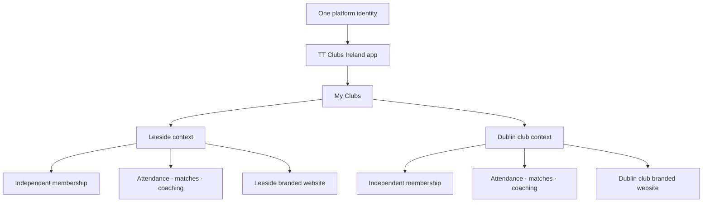
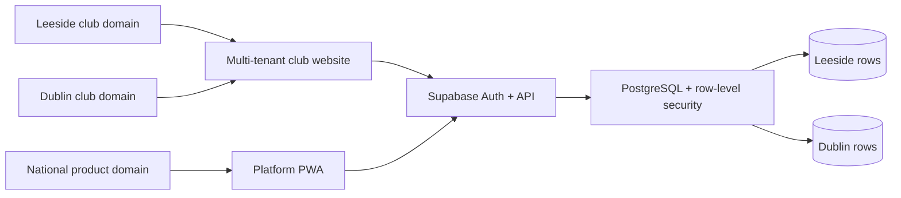
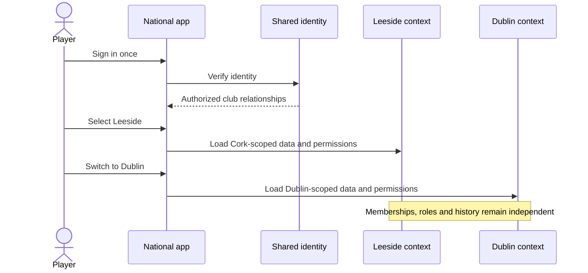
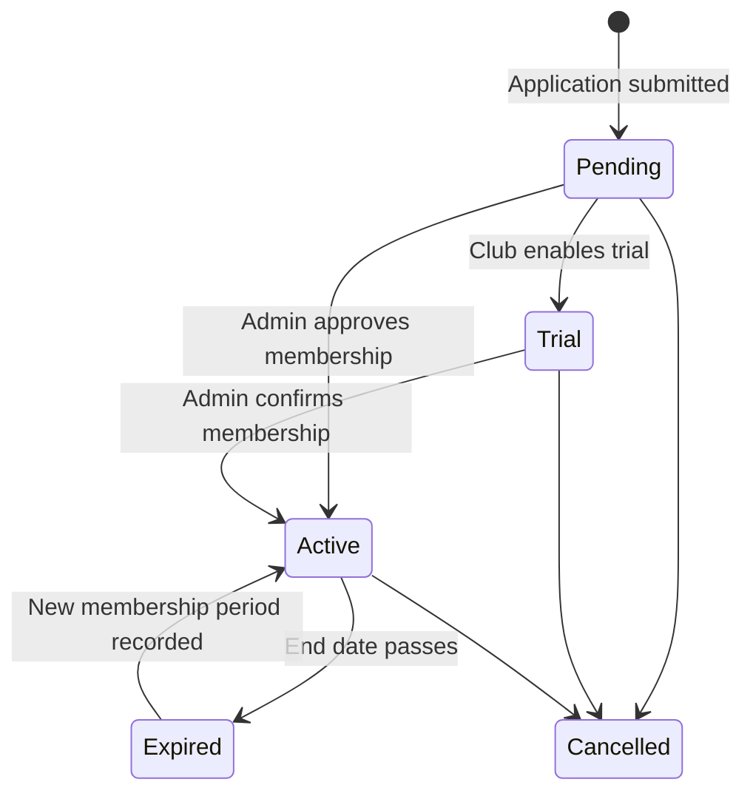
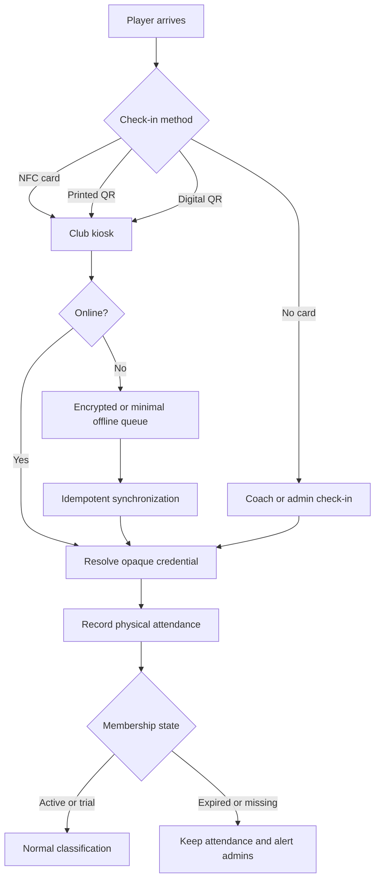
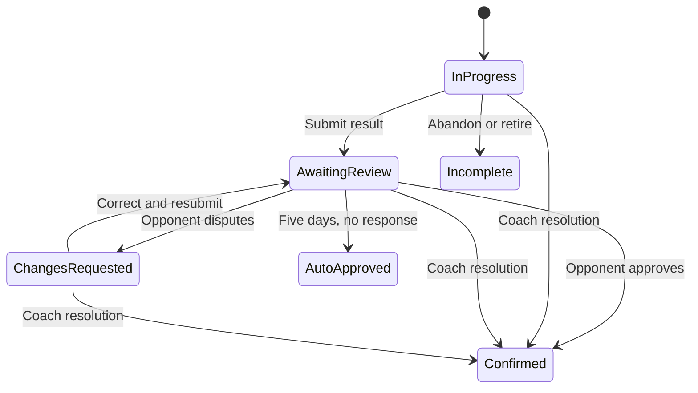

# TT Clubs Ireland

TT Clubs Ireland is a multi-club platform for table-tennis players, guardians, coaches, and club administrators. It launches with Leeside Table Tennis Club in Cork while keeping the product, identity model, and data boundaries ready for clubs throughout Ireland.

This repository contains two distinct products backed by one secure, club-scoped platform:

- **Club websites:** individually branded public websites and administration areas. Leeside is the first portfolio.
- **National platform app:** a neutral installable web app where one person can participate in several clubs with one account.

The repository is an initial runnable foundation. The interfaces use labelled synthetic demo data; they do not yet process live member data. The authoritative scope and acceptance scenarios live in [`openspec/changes/launch-cork-club-platform`](openspec/changes/launch-cork-club-platform).

## Product model



A club website is not a separate data silo. The website and app read and update the same canonical club records. Roles and membership are granted separately for each club. Being an admin or coach in Cork never grants access in Dublin.



## Features and overall flows

The feature list below reflects all approved OpenSpec capabilities. “Planned” means the schema or UI foundation may exist, but the end-to-end production workflow is not complete yet.

### Identity, roles, and multi-club participation

- One account across the club website and national app.
- Any valid email provider is accepted; Gmail is not required.
- Email and mobile contacts are stored and verified independently, and both can attach to the same identity.
- The near-zero-cost pilot guarantees email/password or email-link authentication; optional phone OTP requires a configured SMS provider.
- Club-scoped player, guardian, coach, admin, and scanner-operator roles.
- “My Clubs” lists every club relationship and its independent membership state.
- Explicit context switching prevents data from different clubs being mixed.
- Junior profiles can be linked to one or more responsible adults.
- Juniors and offline members can have complete player profiles without personal login credentials.
- Adult-facing actions and sensitive messages for juniors go to the appropriate guardian.



### Club website portfolio

- Club-specific domain, branding, contacts, policies, timetable, membership details, news, media, and events.
- Public content available without a member account.
- The correct portfolio is resolved from a verified hostname.
- Authorized admins update the same content from the branded website or the app.
- Accessible responsive pages, keyboard operation, semantic structure, focus states, and reduced-motion support.

### Membership and manual payments

- Public join QR and memorable club join code.
- Adult self-application and guardian-led junior application.
- Pending application, optional trial, active, expired, and cancelled states.
- Configurable full, partial, pay-as-you-go, or other club-defined membership types.
- Admin-managed membership start/end dates and status.
- Manual recording of money received outside the platform; no card or bank credentials are stored.
- Payment state remains separate from membership validity and attendance.
- Non-formal email acknowledgement when an admin records or corrects a payment.
- Club-configurable 10-day, 3-day, or both renewal reminders.



### Sessions and bookings

- Recurring timetable definitions generate dated session occurrences.
- Sessions can change or be cancelled without rewriting historical attendance.
- Authorized players or guardians can book eligible sessions and events.
- Capacity and membership rules are enforced by the backend.
- Admins manage bookings; attendance remains a separate record of physical presence.

### Attendance and the club scanner

- Recommended member card combines an inexpensive NDEF NFC tag with a printed QR fallback.
- A club-controlled NFC-capable Android phone or tablet runs the kiosk PWA.
- An authenticated member or guardian can display a short-lived digital QR.
- Children and members without phones use the physical card.
- Admin or coach can check in someone who forgot their card.
- Expired or missing membership **does not discard attendance**. The visit is recorded, classified, and creates a deduplicated admin follow-up alert.
- Bounded offline scanning queues idempotent events and visibly synchronizes later.
- Reports cover daily, weekly, monthly, custom range, utilization, membership segments, and staff-only top attendance.
- Configurable daily admin digest summarizes activity without putting sensitive member detail in email.



### Local matches

- Players start singles or doubles during a session, with registered or guest participants.
- Optional table number and configurable best-of format.
- Game-by-game scoring uses win-by-two validation.
- Matches can be paused, resumed, submitted, or retained as incomplete.
- The opposing side receives an in-app review notification and can approve or request an edit.
- Unchallenged results auto-approve after five days; a modification request pauses the deadline.
- Coaches can intervene, correct, approve, or resolve disputes with an audit trail.
- Incomplete and retired matches stay in history but do not affect statistics.
- No persistent internal skill rating is calculated in the first release.



### Club tournaments

- Coaches/admins create dated round-robin leagues or single-elimination tournaments.
- Singles, doubles, registered players, and guests are supported.
- Configurable match format, points, tie-breaks, seeding, and optional table assignments.
- Fixtures, standings, and brackets use confirmed results only.
- A coach/admin can nominate a player to operate one tournament when staff are absent.
- Delegation is revocable and tournament-only; it never grants membership, payment, role, or dispute authority.
- The organizer can select and check in participants, including someone not previously checked in.

### Player development

- Private coach working notes are separate from player-visible summaries.
- A coach deliberately publishes strengths, improvement areas, and future goals.
- Adult players see their published summaries; guardians see those of linked juniors.
- Private notes are excluded from player/guardian views and ordinary exports.
- Conclusions remain human-authored; automated coaching advice is outside the first release.

### Club administration and communications

- The same authorized management tools are available from a club website or app club context.
- Admins manage members, membership, payments, content, sessions, bookings, attendance, matches, tournaments, communications, and settings.
- Shared work supports claiming, assignment, comments, reassignment, and resolution.
- Each administrator has an individual account; there is no shared admin password.
- Append-only audit records cover sensitive or member-affecting changes.
- Notification outbox supports retry, delivery status, and logical duplicate prevention.
- Personal-data export/correction and retention workflows are launch requirements.

## Repository structure

```text
apps/
  club-web/       Reusable domain-mapped club website; Leeside first
  platform/       Neutral installable national PWA
packages/
  domain/         Shared types, permissions, context helpers and tests
  ui/             Accessible shared UI primitives, not shared club branding
supabase/
  migrations/     Versioned PostgreSQL schema and RLS foundation
  tests/          Database authorization tests
docs/
  ACTION_ITEMS.md External accounts, decisions, and launch checklist
  TRACEABILITY.md Code-to-OpenSpec capability map
openspec/
  changes/launch-cork-club-platform/  Proposal, design, specs, and tasks
```

One repository is intentional. The applications deploy independently but share domain contracts and backend services. A new club adds configuration, a verified domain, branding, and administrators—not a source-code fork.

## Technology

- TypeScript, React, and Vite for both frontends.
- Progressive Web App foundation for Android, iPhone, tablets, and desktop.
- PostgreSQL, authentication, storage, row-level security, scheduled work, and server functions through Supabase.
- Cloudflare Workers Static Assets for frontend hosting.
- Resend for transactional email after a sending domain is verified.
- Expo/React Native is the native path only if the PWA pilot demonstrates a need.

## Run locally

Prerequisites: Node.js 20.19 or newer and npm 11 or newer.

```bash
npm install
npm run dev:club       # http://localhost:4173
npm run dev:platform   # http://localhost:4174
```

Run the full quality gate:

```bash
npm run check
```

For a local database, install Docker and the [Supabase CLI](https://supabase.com/docs/guides/local-development), then run:

```bash
npx supabase start
npx supabase db reset
```

Copy `.env.example` to each app as `.env.local` only when connecting a Supabase project. Never commit service-role keys or live personal data.

## Current implementation status

Implemented foundation:

- npm-workspaces monorepo and continuous integration.
- Responsive Leeside club website demonstration.
- Responsive neutral platform PWA demonstration.
- Multi-club “My Clubs” selection with isolated per-club roles and status.
- Shared typed domain and permission helpers with unit tests.
- Initial multi-tenant PostgreSQL schema, RLS-deny-by-default foundation, synthetic seed, and database-test scaffold.
- OpenSpec task list and code traceability.

Not yet production-ready:

- Live Supabase authentication/data wiring.
- Complete table-specific RLS policies and adversarial authorization tests.
- Registration, membership, scanner, booking, email, match, tournament, coaching, reporting, and admin mutations.
- Production domains, email identity, schedules, backups, monitoring, policies, and acceptance testing.
- Native App Store or Play Store binaries.

See [Remaining actions](docs/ACTION_ITEMS.md) for every owner action and [OpenSpec tasks](openspec/changes/launch-cork-club-platform/tasks.md) for implementation progress.

## Security and data handling

This product will contain junior, membership, attendance, match, payment-metadata, and coaching data. Do not import real members during development. Use synthetic identities until privacy notices, safeguarding rules, retention, administrator ownership, recovery procedures, and row-level-security tests are approved. Manual payment records must never contain personal bank credentials.

## Licence

See [LICENSE](LICENSE).
